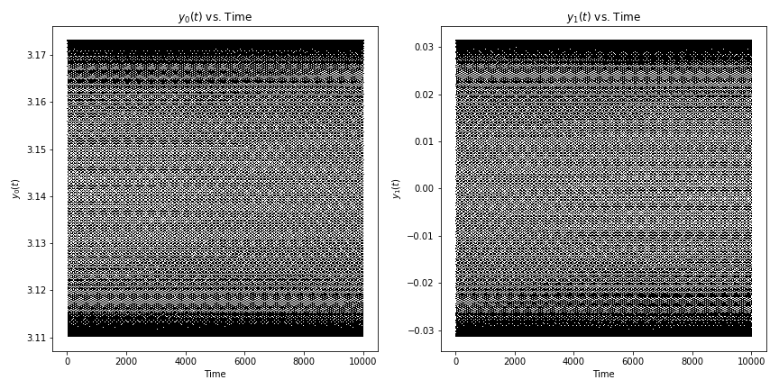

# Integration Test
This jupyter notebook shows the difference between using a user-coded 
Velocity Verlet symplectic integrator and two different integrators 
using `scipy.integrate.solve_ivp`. Note: `solve_ivp` is recommended for 
new code over the earlier `ode_int`.

The _Velocity Verlet_ is a symplectic integration algorithm. This means 
the for Hamilitonian systems, the energy is conserved. It is a second-order 
algorithm.

To compare, I use the "standard" fourth-order Runge-Kutta algorithm. I 
looked through the documentation for `solve_ivp` and tried the other 
algorithms. The best was the `Radau` implicit algorithm. Because it is 
an implicit algorithm, it takes more calculations per step.

# Results
To test the integrations I turned off the driving force by setting `b = 0`,  
the damping by setting `\gamma = 0`, and used a small amplitude to make the 
ocsillation linear.

The Velocity Verlet is clearly the winner. First it conserves energy. This 
can seen because over 100,000 steps, the `phi-omega` phase plot repeats 
itself in a clean line. It also has an execution time of 2.05 seconds. The 
variables versus time plots show constant amplitude, so energy is neither 
lost nor gained in the integration. 

The next best algorithm is the Radau algorithm. Over 100,000 steps, the 
amplitude instead of staying constant, decreases by about 10%. The phase 
diagram widens into a torus. The execution time is 111 seconds, about 50 
times slower than the Velocity Verlet algorithm.

Finally for the default Runge-Kutta, the amplitude increases by about 30%. 
The execution time was 2.75 seconds.

I worked with other parameter values to simulate driven and damped 
simulations. The same conclusions hold; the Velocity Verlet algorithm 
outperforms the algorithms in the `scipy` python library.
